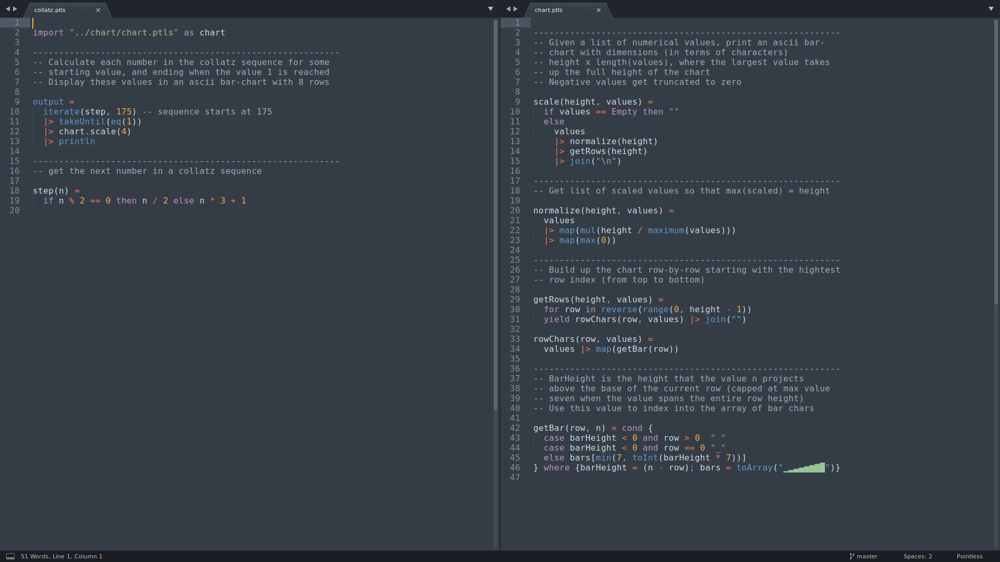

# pointless-sublime

Pointless syntax support for [Sublime Text](https://www.sublimetext.com/)

Available as package `Pointless` on [Package Control](https://packagecontrol.io/)

Language homepage: [https://ptls.dev](https://ptls.dev)

Includes languge syntax definitions and support for commenting and auto-indentation

